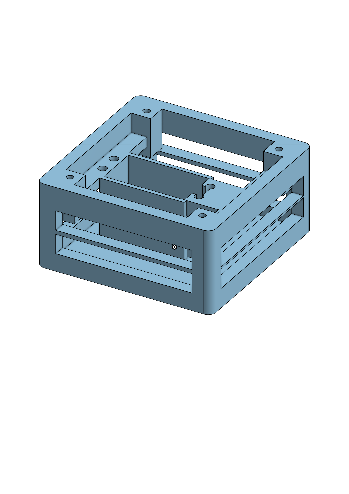
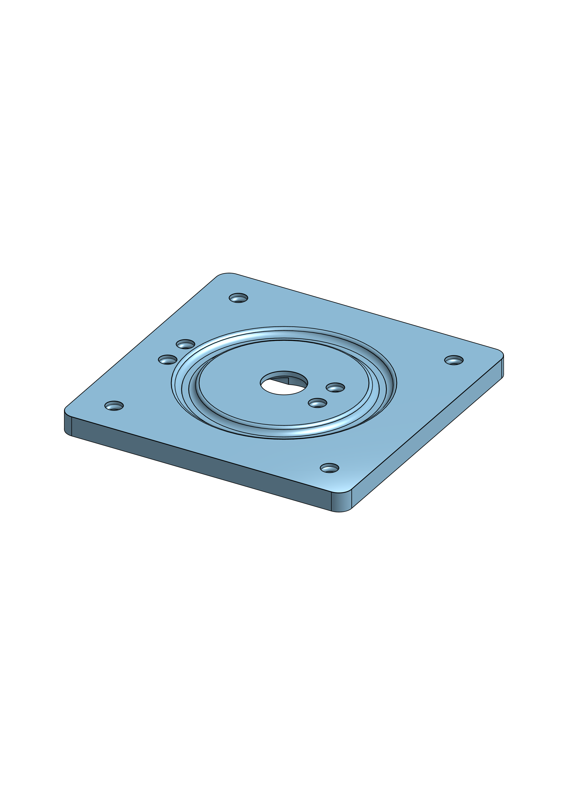
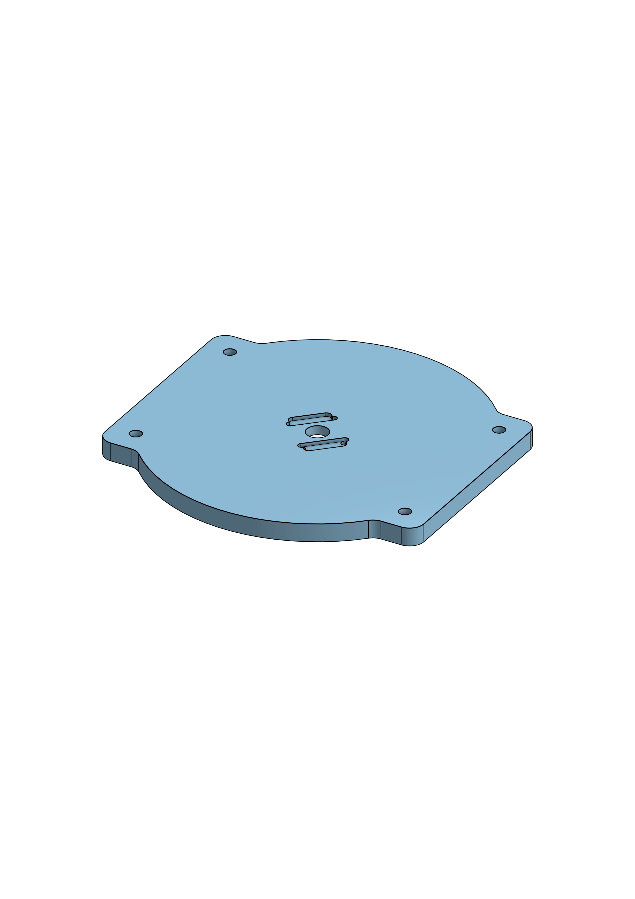
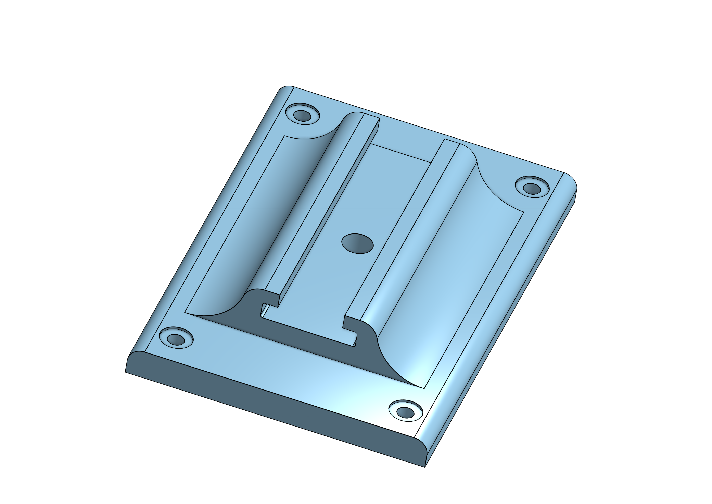

# 3D Printed Components

Custom-designed mounting system for the Nerf turret with ball-bearing rotation mechanism.

---

## 1. Servo Housing - Bottom
**File:** `main_part_FINAL.stl`

**Purpose:** Securely holds the servo motor with the rotation shaft precisely aligned to the geometric center of the housing. Includes cable routing gaps for servo wires.

---

## 2. Servo Housing - Top
**File:** `top_panel_finall.stl`

**Purpose:** Top cover with integrated circular race channel for 0.6mm airsoft BBs. Creates the lower surface of the ball bearing mechanism. Attaches to bottom housing via screw holes.

---

## 3. Rotating Platform
**File:** `rotating-platform.stl`

**Purpose:** Sits on the airsoft BB race and rotates smoothly. Connects to the servo horn via center screw hole. Provides mounting surface for the tactical rail adapter.

---

## 4. Tactical Rail Mount
**File:** `tactical_rail_final_2.stl`

**Purpose:** Adapter that attaches to the rotating platform and provides a standard tactical rail interface for mounting the Nerf blaster.

---

## Assembly Overview

1. Insert servo into bottom housing
2. Place top housing and fill race with some airsoft BBs (0.6mm) until you cannot fill further more. 
3. Mount rotating platform on BB race
4. Attach servo horn through center hole
5. Install tactical rail mount on platform
6. Slide Nerf blaster onto tactical rail

---

## Required Hardware

- **0.6mm airsoft BBs:** ~50 pieces (for ball bearing race)
- **Screws:** 8-12 pieces (various lengths for assembly)
- **Servo motor:** MG996R or similar metal gear servo
