# System Architecture

## Overview

The Nerf turret is built as a **real-time control system** with a continuous feedback loop. The system captures video frames, detects people, tracks targets by adjusting servo position, and executes responses based on configuration and detection status.

## High-Level Architecture

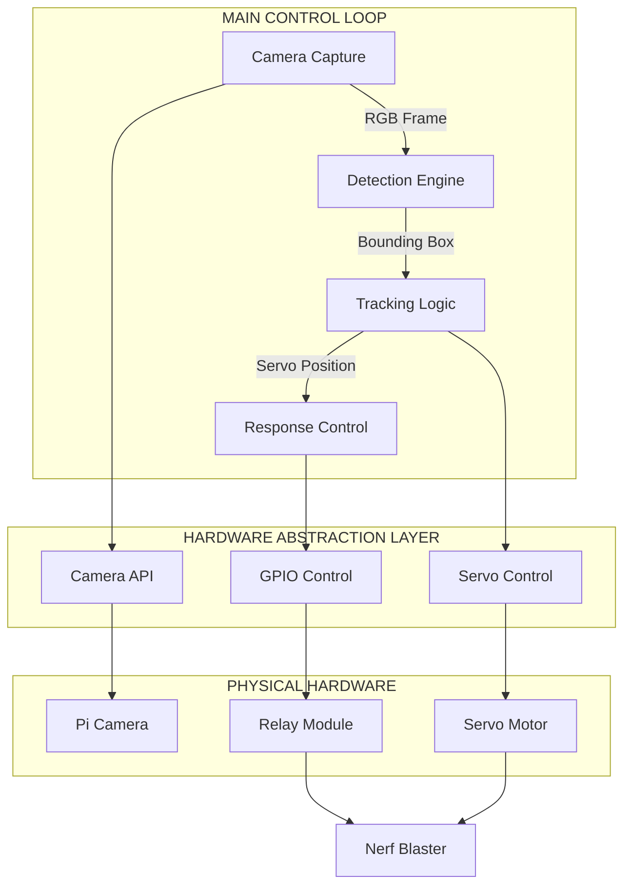

---

## Core Components

### 1. Camera Capture Module

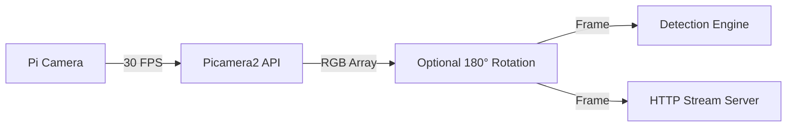

**Purpose:** Continuously captures video frames from the Pi Camera

**Implementation:**
- Uses `Picamera2` library for camera interface
- Captures at 640x480 resolution
- Optional 180° rotation for inverted mounting
- Runs in main thread (blocking capture)

**Key Code:**
```python
picam2 = Picamera2()
config = picam2.create_preview_configuration(main={"size": (640, 480)})
picam2.configure(config)
raw = picam2.capture_array()  # Gets frame as numpy array
```

---

### 2. Detection Engine

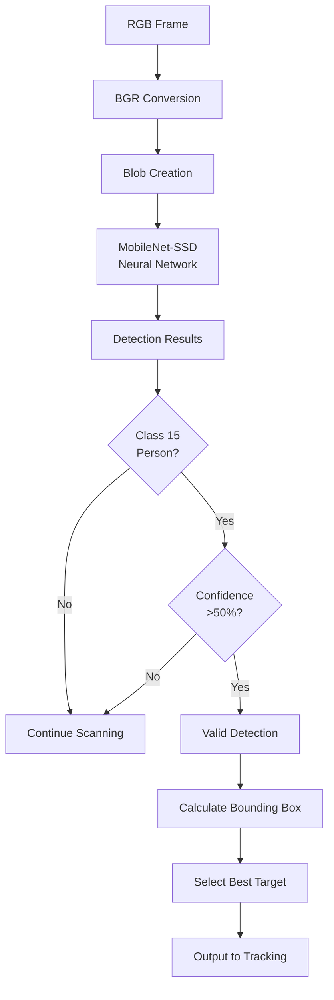

**Purpose:** Identifies people in captured frames using computer vision

**Implementation:**
- Uses **MobileNet-SSD** pre-trained model
- Detects 20 object classes (we filter for class 15 = person)
- Confidence threshold: 50% (adjustable)
- Runs inference on every captured frame

**Key Algorithm:**
```python
# Convert to blob for neural network
blob = cv2.dnn.blobFromImage(frame, 0.007843, (300, 300), 127.5)
net.setInput(blob)
detections = net.forward()

# Filter for people (class 15) above threshold
for detection in detections:
    if class_id == 15 and confidence > 0.5:
        # Valid person detected
        bounding_box = calculate_box(detection)
```

**Output:** 
- `None` if no person detected
- `(x1, y1, x2, y2)` bounding box coordinates if person found

---

### 3. Tracking Logic

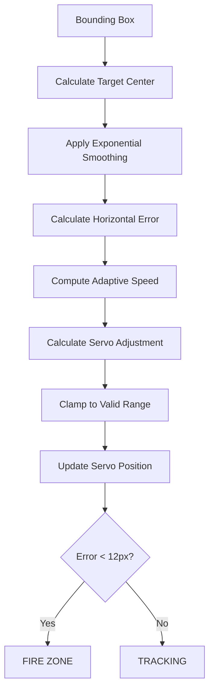

**Purpose:** Calculates servo adjustments to keep detected person centered

**Key Concepts:**
- **Error Calculation:** Horizontal distance between target center and frame center
- **Smoothing:** Exponential moving average to reduce jitter
- **Adaptive Speed:** Moves faster when far from target, slower when close

**Adaptive Speed Formula:**
```python
distance = abs(error_x)
speed_factor = min(distance / 300, 1.0)  # Normalize to [0, 1]
adaptive_speed = 0.02 + (0.20 - 0.02) × speed_factor
# Result: 0.02 (near center) to 0.20 (far from center)
```

---

### 4. Response Control

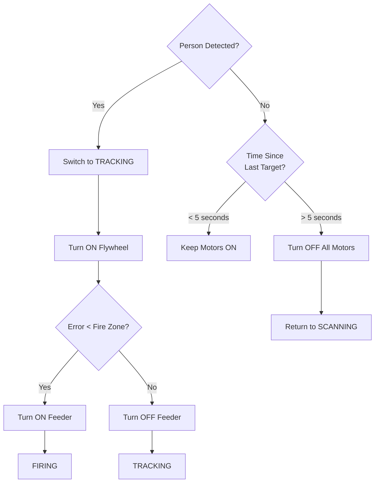

**Purpose:** Manages firing mechanism based on tracking state

**Hardware Control:**
```python
# Active-low relays (LOW = ON, HIGH = OFF)
GPIO.output(FLYWHEEL_PIN, GPIO.LOW)   # Turn ON flywheel
GPIO.output(FEEDER_PIN, GPIO.LOW)     # Turn ON feeder
```

---

## State Machine

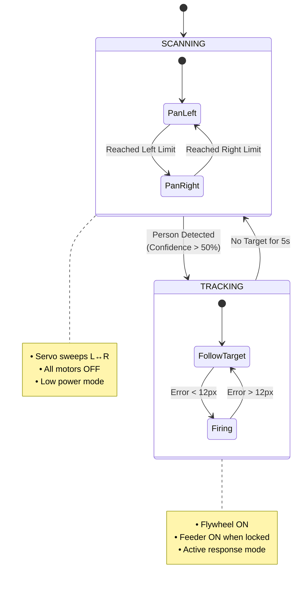

### SCANNING Mode
**Behavior:**
- Servo sweeps left and right at constant speed
- Scan range: -0.2 to 0.8 (servo value)
- Both motors OFF (no power consumption)
- Detection runs every frame looking for people

**State Variables:**
```python
mode = "SCANNING"
scan_direction = 1  # 1 = right, -1 = left
servo_pos += scan_direction × SCAN_STEP
```

**Transition to TRACKING:** When `confidence > 0.5` for class 15 (person)

---

### TRACKING Mode
**Behavior:**
- Servo actively follows detected person
- Flywheel motor ON continuously (fast response time)
- Feeder motor ON only when aim is good (within fire zone)
- Updates servo position based on target location

**State Variables:**
```python
mode = "TRACKING"
smooth_cx = exponential_moving_average(target_center_x)
last_target_seen_time = current_time
```

**Transition to SCANNING:** When `time_since_target > 5.0 seconds`

---

## Data Flow Pipeline

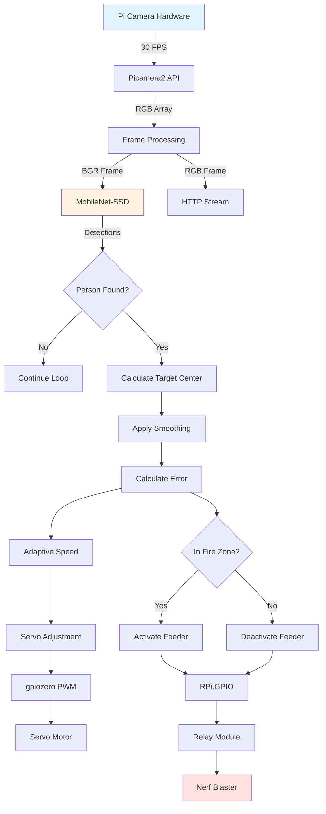

---

## Timing and Performance

```mermaid
gantt
    title Control Loop Timing (per iteration)
    dateFormat X
    axisFormat %L ms
    
    Frame Capture           :a1, 0, 33
    BGR Conversion          :a2, 33, 5
    Detection Inference     :a3, 38, 120
    Tracking Calculation    :a4, 158, 5
    Servo Update            :a5, 163, 2
    GPIO Update             :a6, 165, 2
    
    section Total
    Complete Loop           :milestone, 167, 0
```

### Performance Metrics

| Operation | Target Time | Actual Performance | Status |
|-----------|-------------|-------------------|--------|
| Frame capture | 33ms (30 FPS) | ~33ms | ✅ |
| Detection inference | <150ms | ~100-150ms | ✅ |
| Servo response | <200ms | ~50-100ms | ✅ |
| Total loop time | <200ms | ~100-167ms | ✅ |
| Effective FPS | >5 FPS | 6-10 FPS | ✅ |
| Lost target timeout | 5000ms | Exactly 5000ms | ✅ |

---

## Module Architecture

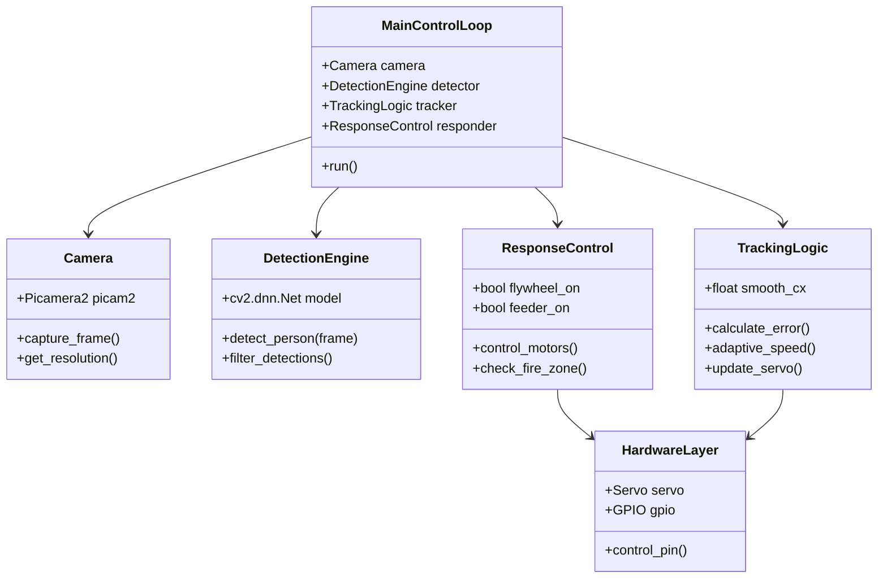

---

## Configuration Parameters

### Vision Configuration
| Parameter | Value | Purpose |
|-----------|-------|---------|
| `CONFIDENCE_THRESHOLD` | 0.5 | Detection confidence (0-1) |
| `CAM_RES` | (640, 480) | Camera resolution |
| `FLIP_180` | 1 | Rotate image if inverted |

### Servo Configuration
| Parameter | Value | Purpose |
|-----------|-------|---------|
| `SERVO_PIN` | 12 | GPIO pin for servo |
| `SCAN_LEFT` | -0.2 | Leftmost scan position |
| `SCAN_RIGHT` | 0.8 | Rightmost scan position |
| `SCAN_STEP` | 0.015 | Movement per frame |

### Tracking Configuration
| Parameter | Value | Purpose |
|-----------|-------|---------|
| `FIRE_ZONE` | 12 | Pixels from center to fire |
| `MIN_SPEED` | 0.02 | Minimum servo speed |
| `MAX_SPEED` | 0.20 | Maximum servo speed |
| `TARGET_SMOOTHING` | 0.4 | Smoothing factor (0-1) |
| `LOST_TARGET_TIMEOUT` | 5.0 | Seconds before giving up |

### Hardware Configuration
| Parameter | Value | Purpose |
|-----------|-------|---------|
| `FLYWHEEL_PIN` | 17 | GPIO for flywheel relay |
| `FEEDER_PIN` | 27 | GPIO for feeder relay |
| `RELAY_ACTIVE_LOW` | True | Relay logic level |

---

## Threading Model

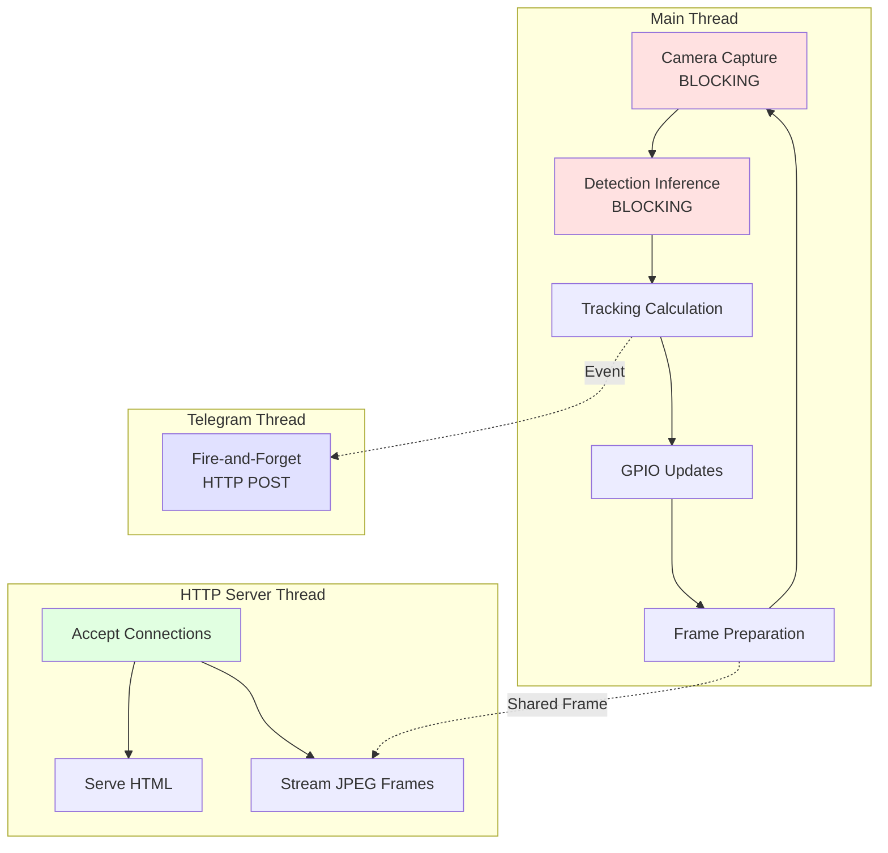

---

## Error Handling Strategy

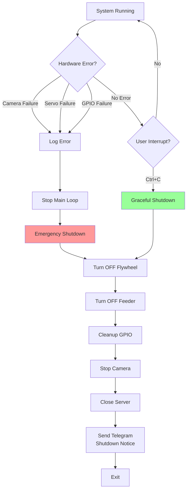

### Graceful Shutdown Sequence

```python
try:
    while True:
        # Main loop
except KeyboardInterrupt:
    print("Stopped.")
finally:
    print("EMERGENCY STOP")
    GPIO.output(FLYWHEEL_PIN, OFF)  # 1. Motors OFF
    GPIO.output(FEEDER_PIN, OFF)
    GPIO.cleanup()                   # 2. Cleanup GPIO
    servo.value = None               # 3. Release servo
    picam2.stop()                    # 4. Stop camera
    server.shutdown()                # 5. Stop server
    telegram_log("System shutdown")  # 6. Notify
```

**Guarantees:** All motors turn OFF in <100ms

---

## Optional Features Architecture

### 1. HTTP Live Stream

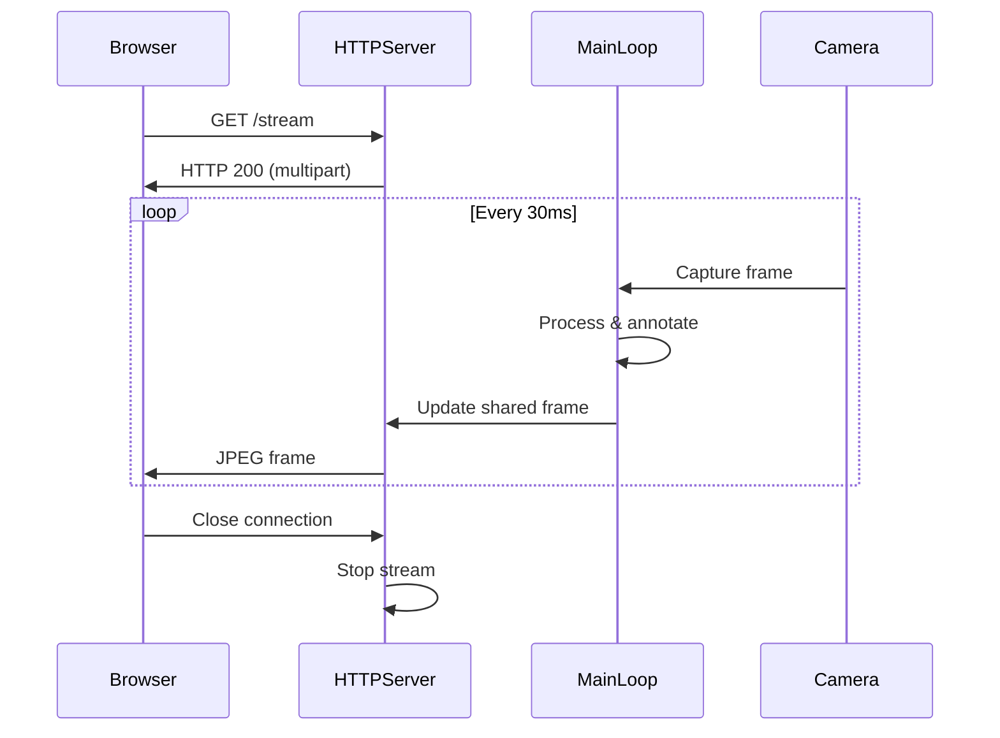

**Implementation:**
- Threaded HTTP server (`ThreadingMixIn`)
- MJPEG stream (multipart/x-mixed-replace)
- Frame shared via `threading.Lock()`
- JPEG quality: 70%

---

### 2. Telegram Notifications

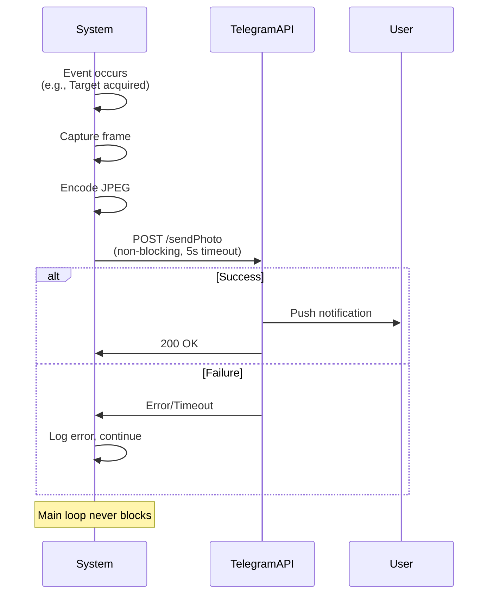

**Events Tracked:**
- System start/stop
- Target acquired/lost
- Firing started/stopped

---

## System Integration Diagram

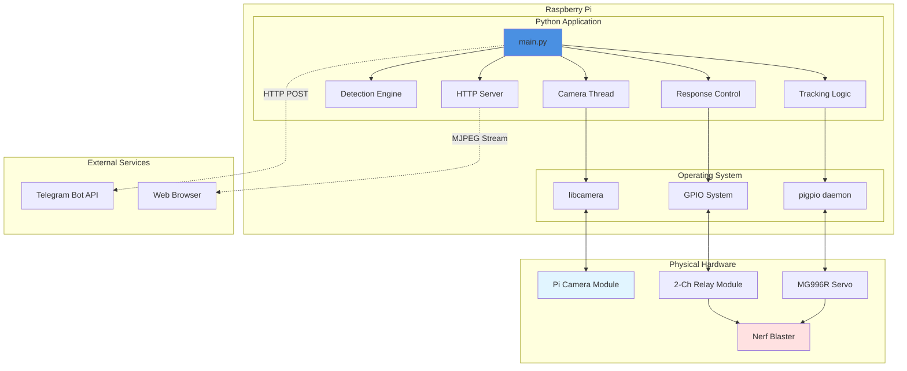

---

## Performance Optimization Strategies

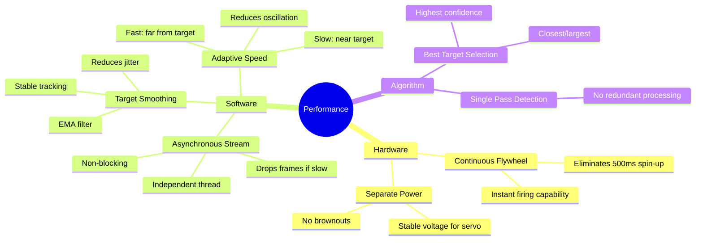

---

## Security & Safety Architecture

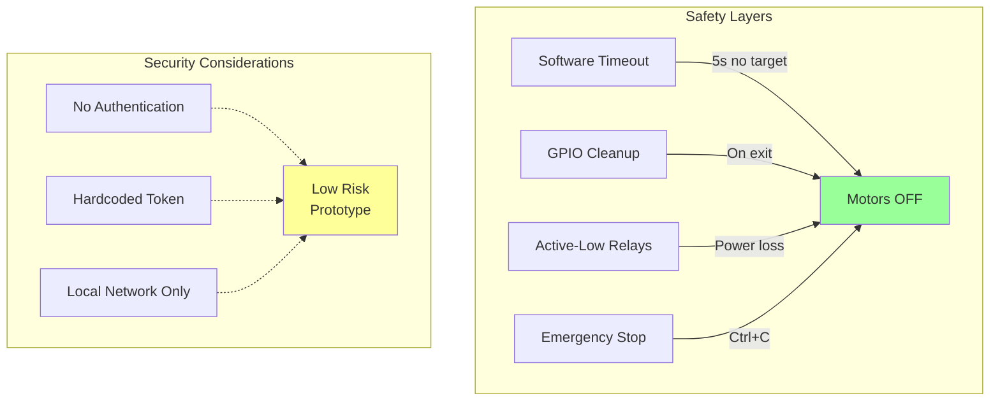

---

## Dependencies

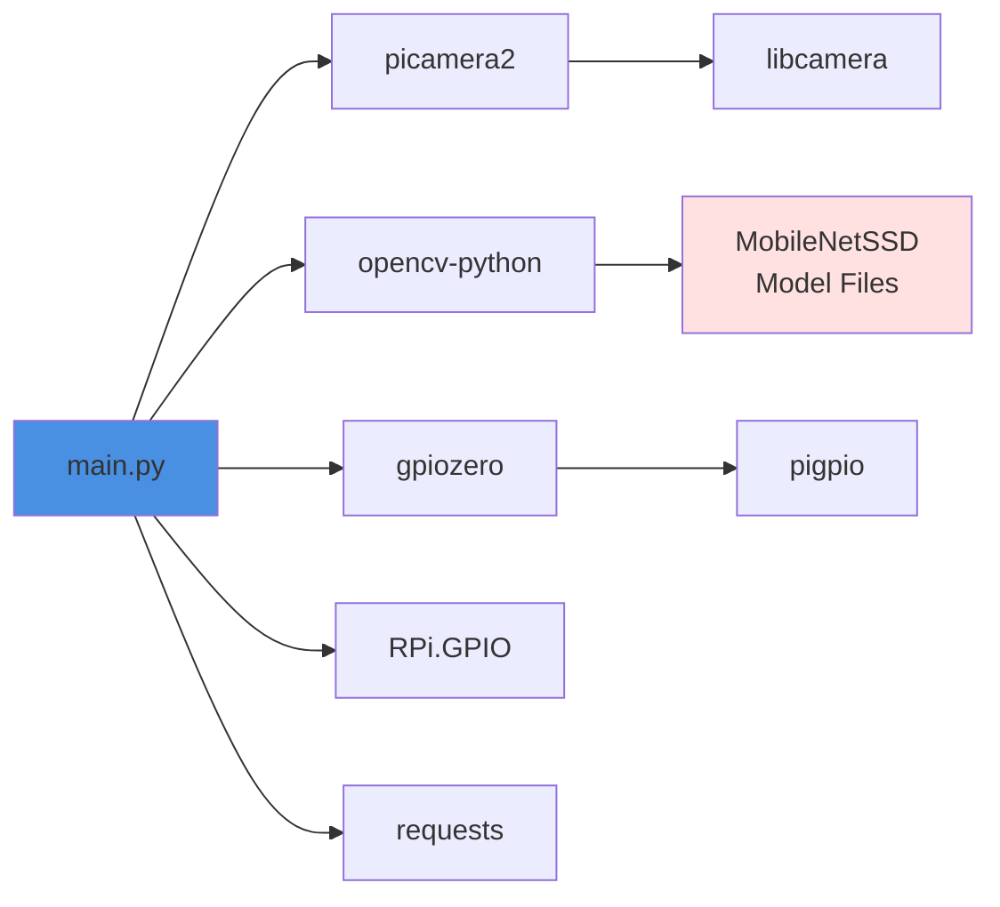

### Model Details
- **Framework:** Caffe
- **Input:** 300×300 RGB
- **Output:** 20 object classes
- **Performance:** ~100-150ms on Pi 4
- **Accuracy:** Good for 2-10m range

---

## Summary

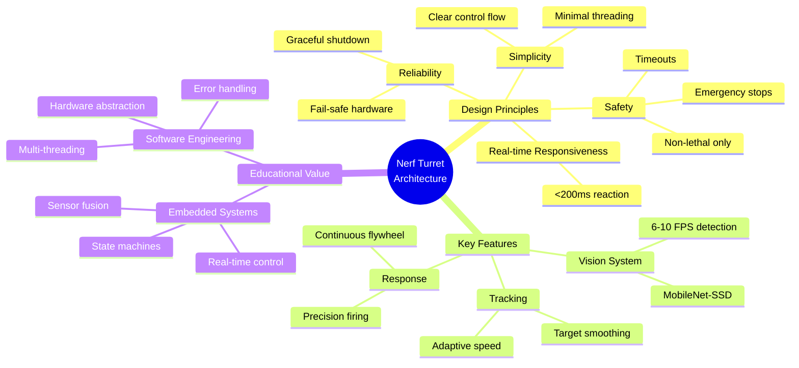

The architecture prioritizes **safe, predictable behavior** over maximum performance, making it suitable for prototype demonstration and educational purposes.