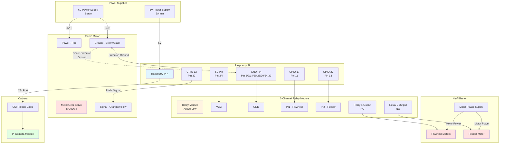

# Hardware Setup Guide

## Required Components

### Electronics
- **Raspberry Pi 4** (or Pi 5)
- **Pi Camera Module** (or USB webcam)
- **Metal Gear Servo Motor** (e.g., MG996R or similar)
- **2-Channel Relay Module** (active-low configuration)
- **5V Power Supply** for Raspberry Pi (3A minimum)
- **External Power Supply** for servo (6V recommended)
- **DC-DC Buck Converter** (e.g., LM2596, XL4015) - According to your powering setup
- **Jumper wires** 

### Mechanical
- **Nerf Blaster** (modified for electronic control)
- **3D Printed Mounts** (custom designed - see [`assets/3d-models/`](../assets/3d-models/))
  - Servo housing with ball bearing race
  - Rotating platform
  - Tactical rail adapter
- **Tripod or Stable Base**
- **0.6mm Airsoft BBs** (for ball bearing race)
- **Hardware** (screws for assembly)

### Optional
- Breadboard for testing
- Heat sinks for Raspberry Pi

## GPIO Pin Assignments

| Component | GPIO Pin | Physical Pin | Notes |
|-----------|----------|--------------|-------|
| Pan Servo | GPIO 12 | Pin 32 | PWM control |
| Flywheel Relay | GPIO 17 | Pin 11 | Keeps motors spinning |
| Feeder Relay | GPIO 27 | Pin 13 | Pushes darts |
| Camera | CSI Port | Camera ribbon cable | Use Pi Camera Module |

**Important:** All GPIO pin numbers use BCM numbering (not physical pin numbers).

## Wiring Diagram



### Connection Details

**Servo Motor:**    
```
Servo Signal (Orange/Yellow) → GPIO 12 (Pin 32)
Servo Power (Red)            → External 6V supply (+)
Servo Ground (Brown/Black)   → External 6V supply (-) AND Pi GND
```

**Relay Module (Active-Low):**
```
Relay VCC  → Pi 5V (Pin 2 or 4)
Relay GND  → Pi GND (Pin 6, 9, 14, 20, 25, 30, 34, or 39)
Relay IN1  → GPIO 17 (Pin 11) - Controls Flywheel
Relay IN2  → GPIO 27 (Pin 13) - Controls Feeder
```

**Relay Outputs to Nerf Motors:**
```
Relay 1 Output (NO) → Flywheel Motors → Motor Power Supply
Relay 2 Output (NO) → Feeder Motor    → Motor Power Supply
```

**Pi Camera:**
```
Camera Ribbon Cable → Raspberry Pi CSI Camera Port
```

**Critical:** All power supplies must share a **common ground** for proper operation.

## Physical Assembly

### 1. Nerf Blaster Modification
- Open the blaster casing
- Identify flywheel motor wires
- Identify dart pusher/feeder motor wires
- Wire flywheel motors to Relay 1 output (NO - Normally Open)
- Wire feeder motor to Relay 2 output (NO - Normally Open)
- Route wires through casing cleanly

### 2. Mounting
- Attach servo to 3D printed pan mount
- Mount Nerf blaster on servo output shaft
- Secure camera pointing in same direction as blaster
- Ensure camera has unobstructed field of view
- Mount entire assembly on tripod or stable base

### 3. Cable Management
- Keep power cables separate from signal cables
- Secure loose wires with zip ties
- Ensure servo can rotate freely without cable interference
- Leave enough slack for full range of motion

## Software Setup

### 1. Enable Camera Interface
```bash
sudo raspi-config
# Navigate to: Interface Options → Camera → Enable
# Reboot when prompted
```

### 2. Install pigpio Daemon
```bash
sudo apt-get update
sudo apt-get install pigpio python3-pigpio
sudo systemctl enable pigpiod
sudo systemctl start pigpiod
```

### 3. Test Camera
```bash
libcamera-hello --timeout 5000
# Should show camera preview for 5 seconds
```

### 4. Test Servo
Create a test file:
```python
from gpiozero import Servo
from gpiozero.pins.pigpio import PiGPIOFactory
import time

factory = PiGPIOFactory()
servo = Servo(12, pin_factory=factory)

servo.min()
time.sleep(1)
servo.mid()
time.sleep(1)
servo.max()
time.sleep(1)
```

## Calibration

### Servo Range Calibration
The servo scan range is defined in the code:
- `SCAN_LEFT = -0.2` (leftmost position)
- `SCAN_RIGHT = 0.8` (rightmost position)

Adjust these values in the code if your servo hits physical limits or doesn't scan wide enough.

### Fire Zone Calibration
- `FIRE_ZONE = 12` pixels from center
- Increase for easier firing (less precision needed)
- Decrease for tighter accuracy (harder to trigger)

### Detection Threshold
- `CONFIDENCE_THRESHOLD = 0.5` (50% confidence)
- Increase to reduce false positives
- Decrease for better detection in poor lighting

## Safety Notes

⚠️ **IMPORTANT SAFETY WARNINGS:**
- Never point the turret at faces or eyes
- Test in a controlled environment
- Ensure emergency stop (Ctrl+C) is accessible
- Keep clear of servo motion range during operation
- Verify relay wiring before connecting high-current loads
- Use appropriate power supplies for all components

## Troubleshooting

### Camera Issues
- **"Camera not detected"**: Check ribbon cable connection, enable camera in raspi-config
- **Poor image quality**: Adjust focus ring on camera lens, improve lighting

### Servo Issues  
- **Servo jittering**: Check power supply, ensure pigpiod is running
- **Servo not moving**: Verify GPIO 12 connection, check servo power supply
- **Limited range**: Adjust SCAN_LEFT/SCAN_RIGHT values in code

### Relay Issues
- **Relays clicking but motors not running**: Check relay output wiring, verify motor power supply
- **No relay clicking**: Check relay module power (VCC/GND), verify GPIO 17/27 connections

### Detection Issues
- **No detections**: Improve lighting, lower CONFIDENCE_THRESHOLD
- **Too many false detections**: Increase CONFIDENCE_THRESHOLD

## Reference Photos

- `assets/wiring_overview.jpg`
- `assets/servo_mount.jpg`
- `assets/relay_connections.jpg`
- `assets/full_assembly.jpg`
